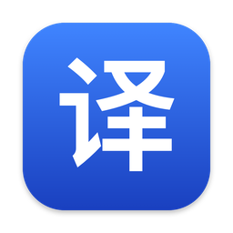
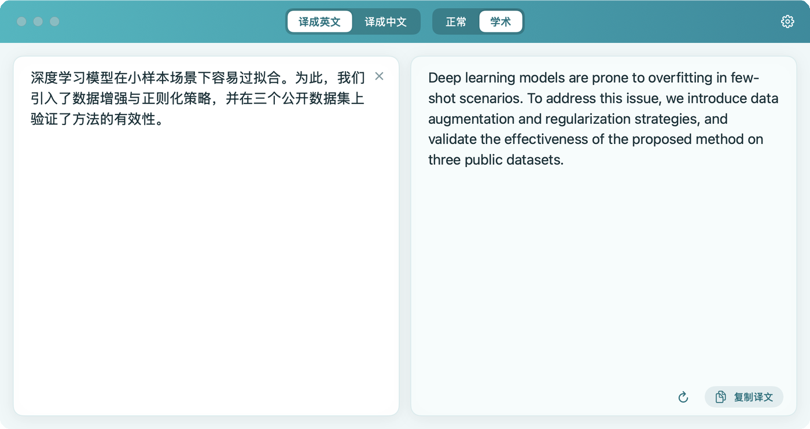
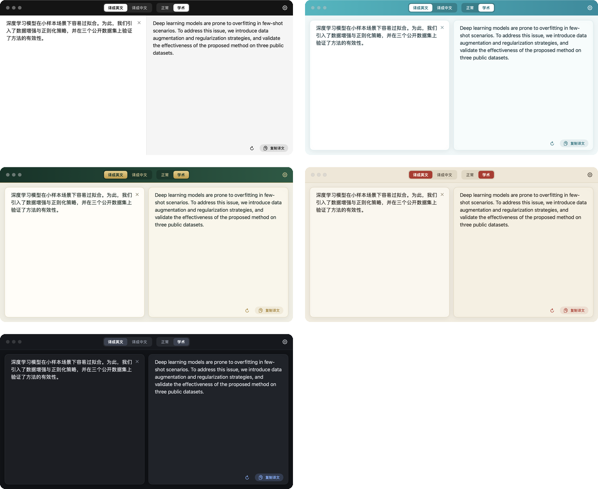
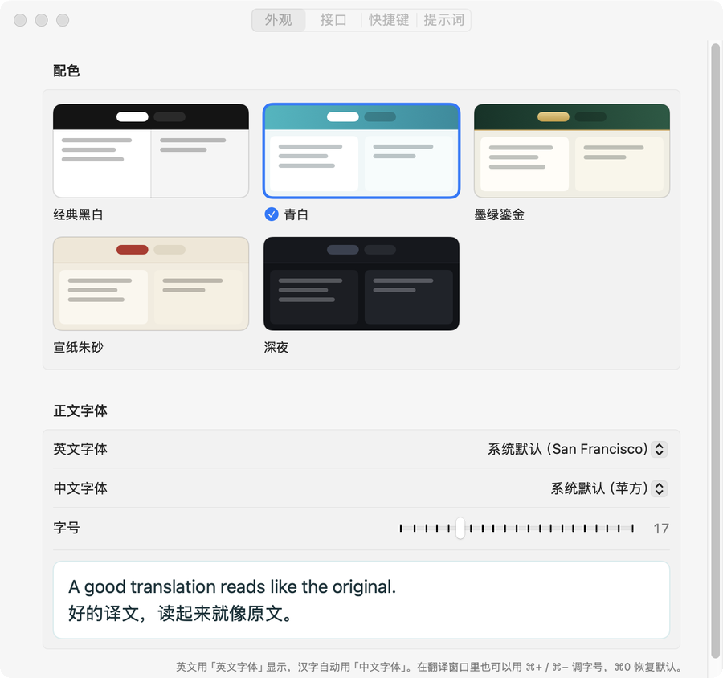

<p align="center">
  
</p>

<h1 align="center">QuickTrans</h1>

<p align="center">自己搓的 macOS 中英翻译小工具：选中文字，连按两下 ⌘C，马上出译文。</p>

<p align="center">
  
</p>

## 为什么做这个

平时读论文、写英文邮件，翻译用得很频繁。DeepL 很好用，但 Pro 订阅实在太贵了。而我真正常用的其实只有一个功能：**把一段文字在中文和英文之间互译**。

现在大模型的翻译质量已经很好，按用量付费也便宜得多。于是自己搓了一个：界面仿 DeepL，只保留"翻译一段文字"这一件事，翻译交给 DeepSeek（也可以换成任何兼容 OpenAI 接口的模型）。

## 它能做什么

- **选中即译**：在其他任何 app 里选中文字，按住 ⌘ 快速连点两下 C，QuickTrans 窗口跳到最前面，原文自动填好，译文边生成边显示。
- **自己决定输出语言**：顶部「译成英文 / 译成中文」两个按钮。原文中英混杂也没关系，输出什么语言由你定。
- **两种风格**：「正常」适合日常；「学术」适合论文，用词正式，公式和引用标记保持原样，译成中文时没有公认译法的术语会在括号里保留英文。
- **快**：默认关闭模型的"思考"模式，实测一句话约 1 秒出完（取决于网络）。
- **从 PDF 复制的断行**：默认提示词会让模型把被硬换行打断的句子连起来翻译。
- **五套配色**：经典黑白（仿 DeepL）、青白、墨绿鎏金、宣纸朱砂、深夜。英文字体和中文字体可以分别选，字号可调。
- **提示词可改**：四条提示词（方向 × 风格）都能在设置里修改。
- **注意隐私**：没选中文字时不会去读剪贴板里的旧内容；密码管理器复制的内容（带"敏感"标记）不会被发送。

<p align="center">
  
</p>

## 安装

需要：

- macOS 14（Sonoma）或更新（作者在 macOS 15 上开发和测试）
- Xcode 命令行工具，Swift 5.10 或更新（不用装完整的 Xcode）
- 管理员账户（`--install` 要往「应用程序」文件夹里写）

**1. 安装命令行工具**（装过、且 `swift --version` 显示 5.10 或更新，可以跳过）：

```bash
xcode-select --install
```

**2. 下载代码并编译安装**：

```bash
git clone https://github.com/Atlamtiz/QuickTrans.git
cd QuickTrans
scripts/build.sh --install
```

脚本会编译代码、打包成 `QuickTrans.app`，装进「应用程序」文件夹并启动。只想编译不安装，就运行 `scripts/build.sh`，结果在 `build/QuickTrans.app`。

## 配置

### 第一步：填 API Key

1. 到 [DeepSeek 开放平台](https://platform.deepseek.com) 注册，创建一个 API Key。
2. 打开 QuickTrans → 设置（⌘,）→「接口」，粘贴 API Key，点「测试连接」。看到"连接成功"就可以用了。

默认配置如下，一般不用改：

| 设置项 | 默认值 |
|---|---|
| 接口地址 | `https://api.deepseek.com` |
| 模型名 | `deepseek-flash` |
| 关闭思考模式 | 开（更快） |

**想换别的模型？** 兼容 OpenAI `/chat/completions` 接口的服务都可以，改接口地址、模型名和 Key 即可。注意：

- 如果对方不认识"关闭思考"的参数而报错，把「关闭思考模式」关掉。
- 远程接口必须是 `https://`；本机服务（如 `http://localhost:11434/v1`）可以用 `http://`。
- 本机模型不需要 Key 的话，随便填一个占位值即可（Key 不能为空）。

### 第二步：打开辅助功能权限

QuickTrans 需要监听快捷键（用自定义组合键时，还要替你按一次 ⌘C 来复制选中的文字），macOS 要求为此授权一次：

**系统设置 → 隐私与安全性 → 辅助功能 → 打开 QuickTrans**

没授权时，主窗口顶部会有一条橙色提示，点「打开系统设置」可以直接跳过去。

> **重新编译安装后，授权会失效。** app 用的是本机临时签名，每次编译出来系统都当它是新 app。
> 如果快捷键突然没反应：在上面的列表里选中 QuickTrans 点「−」删除，再点「+」重新添加。
>
> **不想每次都重新授权**（可选，做一次即可）：打开「钥匙串访问」→ 菜单「钥匙串访问 → 证书助理 → 创建证书…」，名称填 `QuickTrans Local`，身份类型选「自签名根证书」，证书类型选「代码签名」。之后 `scripts/build.sh` 会自动用这个证书签名，重新编译后授权不再失效。第一次签名时如果弹窗要钥匙串密码，请点「始终允许」；从临时签名换成证书签名后，还需要按上面的方法删掉、重新添加授权一次。

## 使用

| 操作 | 方法 |
|---|---|
| 翻译选中的文字 | 按住 ⌘，快速连点两下 C |
| 手动翻译 | 在左边粘贴或输入，停手 0.5 秒自动翻译 |
| 重新翻译 | ⌘↩，或点译文区的 ↻ |
| 调字号 | ⌘+ 放大，⌘− 缩小，⌘0 恢复默认 |
| 复制译文 | 点右下角「复制译文」 |
| 打开设置 | ⌘, |

关掉窗口后 app 仍留在 Dock 里，点 Dock 图标重新打开；⌘Q 退出。

## 设置一览

<p align="center">
  
</p>

| 页 | 内容 |
|---|---|
| 外观 | 五套配色；英文字体、中文字体分别选；字号 |
| 接口 | 接口地址、API Key、模型名、是否关闭思考模式、测试连接 |
| 快捷键 | 连按两下 ⌘C（默认），或换成自定义组合键；辅助功能权限状态 |
| 提示词 | 四条提示词（方向 × 风格），可修改，可恢复默认 |

用自定义组合键时，app 会替你执行一次复制来读取选中的文字，读完后恢复你原来的剪贴板内容。

## 常见问题

**按 ⌘C C 没反应？**
多半是辅助功能权限没开，或者重新安装后失效了，按上面「第二步」处理。主窗口顶部有橙色提示条，就说明当前没有权限。

**提示"没有取到文字"？**
没有选中文字，或者当前 app 的复制功能没生效。先确认普通的 ⌘C 能复制。

**翻译出错？**
错误原因会直接显示在译文区（Key 无效、余额不足、网络问题等）。到设置 →「接口」点「测试连接」可以快速排查。

## 隐私

- 要翻译的文字只发送到你在设置里配置的接口（默认是 DeepSeek），不经过任何其他服务器。
- API Key 只保存在本机的 `~/Library/Preferences/com.atlamtiz.QuickTrans.plist`（明文保存，和其他 app 的偏好设置一样），不在代码里，也不会被上传。

## 代码结构

纯 Swift 编写（SwiftUI + AppKit），不依赖任何第三方库。

| 文件 | 作用 |
|---|---|
| `AppSettings.swift` | 设置项、默认值、四条默认提示词 |
| `TranslationService.swift` | 调用接口、解析流式返回、错误提示 |
| `TranslatorModel.swift` | 原文、译文、方向、风格等状态；防抖与取消 |
| `TranslatorView.swift` | 主窗口界面：顶栏按钮、左右两栏 |
| `Theme.swift` | 五套配色、中英文字体组合、可选字体列表 |
| `HotkeyManager.swift` | 连按两下 ⌘C 的监听、自定义快捷键、剪贴板读取 |
| `SettingsView.swift` | 设置页 |
| `AppDelegate.swift` | 窗口、菜单、Dock 行为 |
| `main.swift` | 程序入口；`--selftest` 自检 |
| `scripts/build.sh` | 编译、打包成 .app、签名、安装 |
| `scripts/make_icon.swift` | 生成 app 图标 |

开发时可以用命令行自检接口是否通畅（会用当前设置把四种"方向 × 风格"各翻一句）：

```bash
build/QuickTrans.app/Contents/MacOS/QuickTrans --selftest
```

## 许可证

[MIT](LICENSE)
